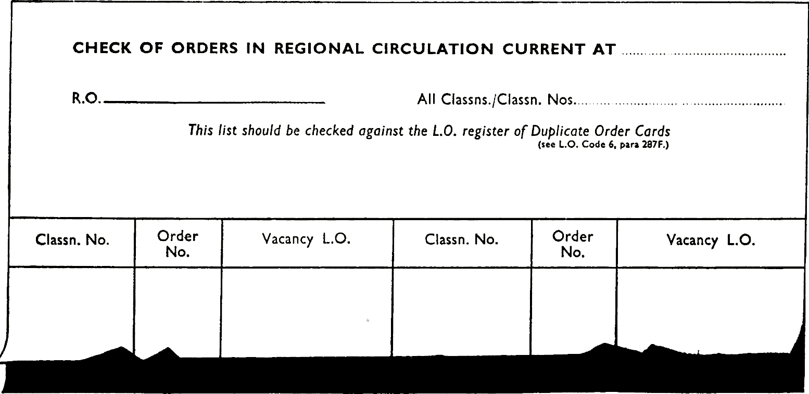

Any of the four main duplicating processes (hectograph spirit, stencil, offset litho, and
typeset) can be used for making copies. The offset litho process may be necessary when
copies must be produced on a paper having a surface for additional written entries
after duplicating; the semi-absorbent paper normally used for stencil duplicating is
not suitable for use with pen and ink.

Some duplicators will not ‘print’ right up to all the edges of the paper, and a
corresponding margin must be allowed. For example, most spirit duplicators require
a blank margin about one inch wide along the edge of the paper which is fed into the
machine.

### Making copies of entries by the Hectograph process

Captions and lines etc. ‘pre-printed’ on a Hectograph ‘master’ copy; entries are added by
typewriter and copies of the complete document for circulation are provided on a spirit
duplicator. The Hectograph carbon sheet at the back is perforated at the top to facilitate
separation from the master after typing entries
