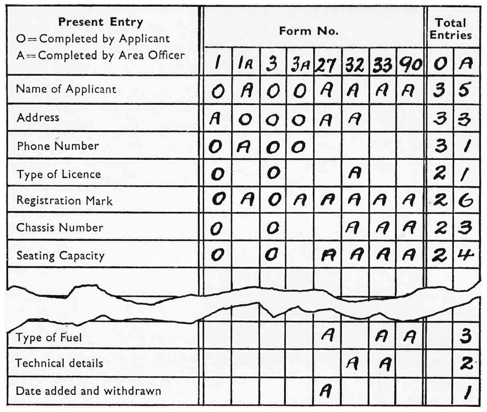
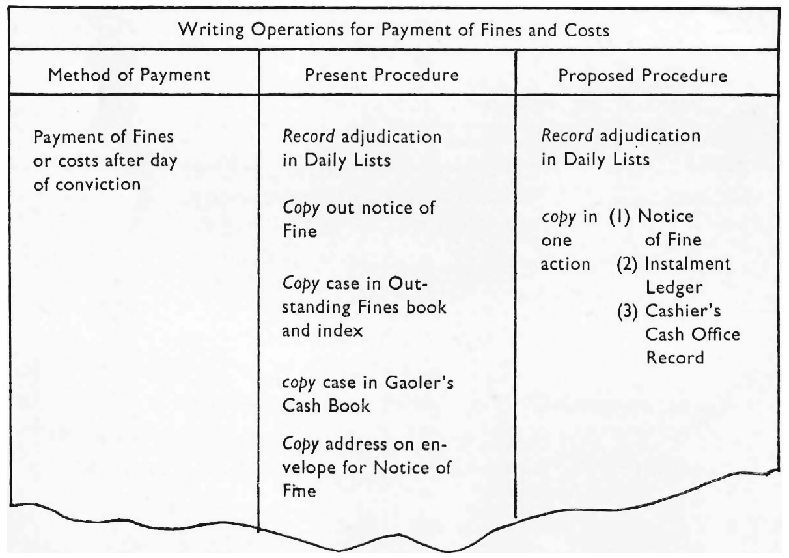
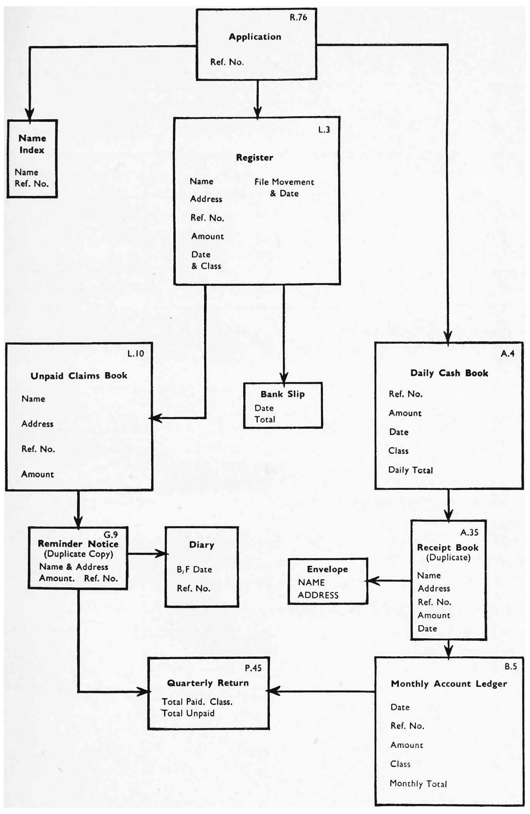

### Relevant Information

IDEALLY, forms should always be studied in the light of an examination of the whole
procedure for which they are required and of associated work that may be done in
other branches or departments. The beginnings and ends of the work should be considered as well as the main processes in between. It is particularly important to see the
complete picture of action when other processes, e.g. copying or recording, are to be
undertaken separately, before or after the main process. So, before a form is designed
or redesigned, one must seek up-to-date facts and information about the procedure,
the purposes for which the form is required, the circumstances in which it will be
completed, despatched, filed, sorted and handled, and, where relevant, a variety of
other information such as the cost and effectiveness of arrangements and operations,
the incidence of errors in completion, queries and difficulties, and the scope for possible
change and improvements.

The scope of the enquiries should therefore be as wide as practicable to ensure the
utmost simplification of work. Forms can never be designed solely as a ‘desk job’, and
direct investigation and observation are important preliminaries. ‘Those responsible
for reviewing the form should always co-operate closely with any O and M unit which
may be operating in the department.

Although the ideal setting for a review of forms is a comprehensive review of the
forms and the associated procedures—on the lines indicated above—it is recognised
that many reviews of forms, by force of circumstances, have to be limited to a review
of the possibilities of improving appearance, layout, intelligibility, or contents without
examining the associated procedures. A limited examination of this kind is, however,
generally well worth while.

As the techniques of investigation of office processes are dealt with, in detail, in
the companion publication, The Practice of O and M they are touched upon only
lightly here. But the following action must always be taken when collecting relevant
information.

Consult

(1) officers responsible for the form or work (and examine completed specimens of
the forms and any associated documents in use);

(2) staff whose work is or will be associated with the form at any stage, in all
branches of the office;

(3) persons who complete or may have to complete the form at any stage, inside or

outside the department;

(4) any departmental committee established to advise on forms used by the public;

(5) any other departments or organisations known to use similar forms.

Refer to

departmental records and libraries of forms held by Forms Control Sections or the
Clerk of Stationery.

### Collecting data

The collection of all the data needed as a basis for designing a form demands great
thoroughness and an enquiring and challenging attitude to existing practices. It will
also require some imagination and inventiveness because the questions to be raised
should be such as to produce information which will reveal, inter alia, the scope for
doing the job in better ways.

The questions to be asked when collecting data relevant to forms design will vary
according to circumstances, but the following should invariably be asked:

(1) WHAT causes the work (and therefore gives rise to the form); what are the
purposes of the form, the operation, the procedure etc.; what are the essential needs
or unalterable limitations?

(2) How is the work done? i.e. what are the processes, operations and documents
involved;

(3) Wuy is the work done in the manner prescribed?

(4) WuHo does the work and to what extent?

(5) WHERE is the work done and what limitations does this impose?

(6) WHEN is the work done and what limitations does this impose?

(7) WuICcH related activities elsewhere need consideration with the form or work
being studied?

Whenever practicable figures should be obtained indicative of:

The number of operations undertaken, forms completed etc.

Incidence of work over a selected period

Volume of arrears of work at selected points in time

Time taken to do work or complete forms

Costs of the various stages of work

Number and nature of errors, queries or other indications of ineffectiveness or

inadequacy.
Assembling data

A record of the procedures involved in the use of the form, setting out in sequence

all the operations concerned, will establish the facts and aid analysis. Usually a narra-
tive, step by step, record is adequate, but sometimes other forms of record or chart are

## COLLECTING, ASSEMBLING AND ANALYSING RELEVANT INFORMATION

valuable. Where a series of forms has to be studied it may be of advantage, as an
alternative, to mount specimens on a large sheet of paper or linen or on a blackboard
and record the associated action alongside. Various devices, such as connecting lines
to indicate movement, and colours and symbols to represent kinds of data may then
be used.

Whether a narrative record or a pictorial means of setting out the procedures is used,
each operation should be defined in such a way as to bring out the characteristics of the
action, e.g. whether it represents the copying of existing entries or the recording of
new entries. Terms such as ‘write’ or ‘enter’ may obscure the fact that action is
‘copying’, which, if known, would have entailed consideration of the appropriate aids
to copying, e.g. carbons, translucent stationery etc.

A few examples of procedure statements and charts to assist in recording and
facilitate analysis follow. Much more comprehensive information is to be found in
the companion publication The Practice of O and M.

### Analysing data

All the data should be subjected to a searching examination in which the validity of
all that is done and the reasons given for so doing, are challenged. This applies not
only to the action or procedures with which the form is associated but also to the
entries and explanatory notes on the form itself.

The important questions are:

(x) Can anything be eliminated—whether procedure, entry, copy or other feature?

(2) Is everything that is provided for essential and not merely desirable? If any
feature is not strictly essential what inconvenience or loss would result from dispensing
with it?

(3) Can the present sequence or order of actions be changed or actions combined,
with advantage?

(4) Is the same information required in a different order or layout for another
purpose? If so can the order be modified so as to enable the two purposes to be met by
producing copies?

(5) Can action of any kind be simplified?

(6) Are there any costly features of the form, such as carbon patching, multi-colour
printing, etc., which could be replaced by less costly alternatives ?

When these questions have been answered the way is clear to start the design of the
form. It should be remembered, however, that the requirements of design must be
reconciled with what is practicable and economical from the production aspect.

Repetitive data entered on several related forms can be analysed and summarised on these
lines to show entries on revised or combined documents. Letters or symbols could be used
to indicate also how the entry is made, e.g. T for typewriter entries copied from another
documents, or + for a calculation prior to a figure entry

Extract from a note of a series of writing operations, set out for comparison between the
present and proposed procedure and showing a reduction of work by the use of carbon
paper. The word ‘Record’ is used consistently to distinguish new or original entries from
those which are a ‘Copy’ of an existing entry made earlier in the process; this often points
to scope for using carbon paper or combining documents

## CHART FOR ANALYSIS OF DATA IN A SERIES OF FORMS OR DOCUMENTS

Claims Account Procedure: a diagram, or actual forms showing specimen entries, can be
prepared on a large sheet of paper to indicate the source of entries and the sequence in
which details are transferred or copied from one document to another; this may help to
show how documents can be combined
