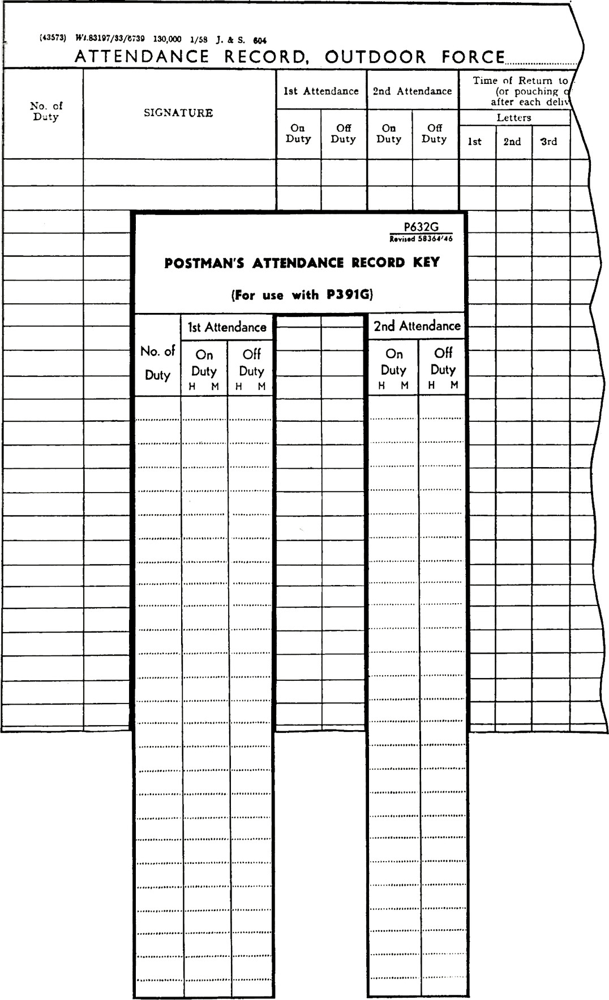

When entries on one document have to be checked or compared with information on another record, and when entries on a form need to be made by copying details already entered on another form or record, the following layout arrangements will make these tasks easier:

1. Captions to entry spaces for the same information on both documents should be identical.

2. Entries on both documents should be (a) in the same sequence and (b) grouped together and positioned for ease of reference, and so that entries to be compared can be brought as close together as possible.

3. Spacing allowances for entries should be the same on both documents.

4. For items that are to be marked off as they are checked, an entry space for the check mark, checker’s initials, stamp etc. should be provided.

Checking and comparing may also be assisted by the use of transparent templates, or masks, showing standard information to be compared with other entries.

When entries are carried forward from one accounting document to another, e.g. for summarising entries on a series of accounting forms, it is sometimes helpful to auditors and new staff if each entry has by it a simple indication of its source.

Documents designed so that the entry spaces are correctly aligned when placed side by side for checking, comparing, or copying entries from one to the other. The stub or spine of the book is provided at the top instead of the side

Form with a mask to assist reading. Standard times are entered on the mask and after aligning the cut-out portion of the mask with the appropriate column of the attendance record, the times recorded on the attendance record are compared
