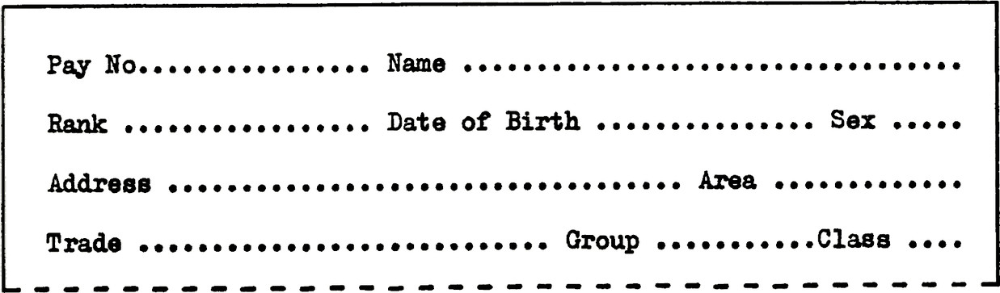
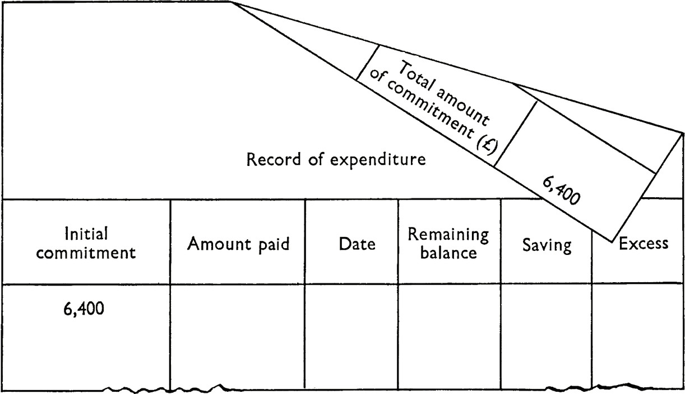
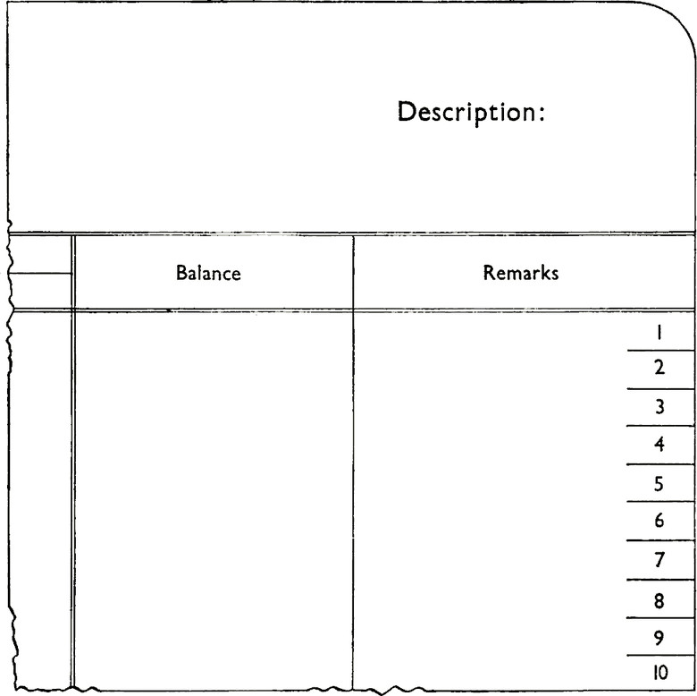

Printed writing lines are rarely necessary on forms completed by typewriter (except to divide groups of entries) as they impede typing when it becomes necessary to adjust the machine platen to the line. Nor are vertical lines needed between { s. d. columns if the tabulator stops can be used (unless such lines are required to assist subsequent work with the form).

As a general rule, entry spacing can be based on ten (pica) or twelve (elite) characters to the horizontal inch. Most typewriters space to }” vertically. The spacing of type on many continuous stationery machines and electric typewriters is different from the standard typewriter.

Forms for use in typewriters should be designed to avoid the need for hand positioning the platen and to minimise use of the space bar. The following layout arrangements will help to reduce carriage movement and facilitate completion of the form:

1. The number of lines of typing should be reduced as much as possible.

2. If possible each new line of typing should begin at the left hand marginal stop position; tabulation positions for each line of entries should as far as possible be the same to avoid the extra operations of skipping unwanted tabulation positions.

3. If some entries are made by referring to other entries already made on the form (e.g. repeating a name or address, or entering an amount in words after entering it in figures), make sure that the reference-entry will be visible when the second entry is being typed.

4. When a total is carried forward tumbler printing is useful

(a) from one side of the form to the other, enabling bring forward figures to be copied whilst the form is in the machine, or (6) when documents such as ledger sheets or postcards are typed on both sides.

5. Entries should not be positioned near the top and bottom of the form; it is usually difficult to type within 1” from the top, or $” from the bottom of a document
unless continuous stationery or a holding device is used.

6. Guide lines or marks at the edge of the form can assist in finding the entry position, or be used as a warning signal that the bottom of the form is about to be reached.

The width of the form must be related to the width of the platen of the typewriter likely to be used in completing it. If this is not known it may be as well to design the form for the (minimum) 12” platen which takes paper 11” wide and provides a 10” writing line.

(See page 52 for section on VARITY PING)

This layout, spacing and the use of dotted lines hinders typing. Frequent typewriter adjustments are necessary to complete the entries (10 horizontal and 4 vertical) because tabulator stops cannot be used for groups of entries and because vertical spacing is not at 1/3” intervals. This wastes much time in the aggregate and the information stands out less clearly than in the ‘boxing’ layout below

In this revised layout captions are placed in the top left corner of each panel so that they will not be obscured by the typewriter ribbon when entering; and so that tabulator stops can be used at A, B and C. However, vertical spacing should be in multiples of 1/6” to fit the typewriter

Tumbler printing to facilitate copying the figure for ‘Initial Commitment’ from Commitment Control Document on one side, to a ‘Record of Expenditure’ on the other side, whilst the document is in the machine; by placing the box for the figure in the bottom right-hand corner of the Commitment Control Document the operator can pick up this entry for posting on the Record of Expenditure by folding the corner back as shown

Record card for machine entries with guide lines printed in the right-hand margin
