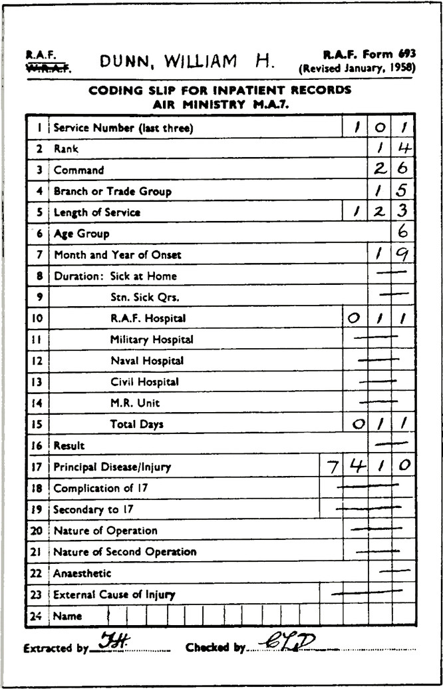
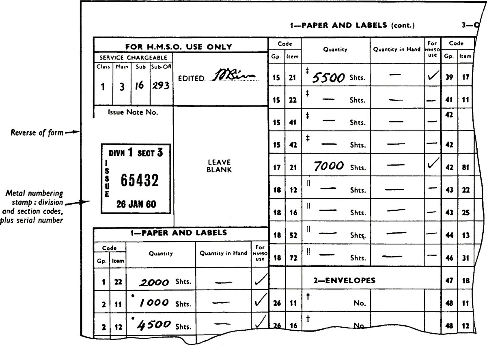
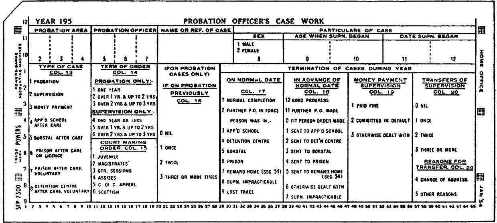

In most punched-card systems, a number of preliminary operations have to be performed to prepare information in readiness for punching into the cards. These operations vary from job to job depending on the type of source document, where and how it is completed, the amount of checking necessary and whether some of the information is required for uses other than punched cards. The design of output documents turns largely on the characteristics of the tabulator or printer employed.

### The original document

The design of the original document is frequently the most important factor in achieving economy and accuracy in the preliminary processes. Wherever possible it should be used as the ‘punching document’, i.e. the document from which information is transcribed on to the punched cards. As such it should be designed to aid (1) the person who has to provide the basic information in manuscript or typewriting, and (2) the punch operator who has to read the information to record it in the form of
punched holes in a card. Occasionally the needs of (1) may be different from (2) or the original document has to be designed to meet other purposes, and either may involve clerical transcription of the information to be punched on to a separate intermediate document suitably designed for presentation to the punch operator. If only part of the information is insufficiently clearly presented a slip on which this information is transcribed can be affixed to the original document, or the document impressed with a rubber stamp, thus avoiding the creation of an entirely separate document. The following points should be considered in the design of original or special punching documents:

1. NUMBER OF PAGES OR NUMBER OF CARDS PER PAGE

Wherever practicable information should be presented to the punch operator on one side of a single page of the punching document and the data not to be punched should be clearly distinguished and separated. As many cards as possible should be completely punched—without a break—from one page, to reduce page turning and encourage a smooth working rhythm.

2. SIZE OF PAGE

Documents should be kept to a convenient size (preferably not larger than foolscap or equivalent size) for handling and for ease of locating the relevant data.

3. COLOUR AND TEXTURE

Legibility is important. Black on white and where appropriate certain other colour combinations give good contrasts but colours that tire the eye, e.g. red background, should be avoided. It is also essential that sufficiently thick and opaque paper be used to prevent information on the reverse side showing through.

4. SEQUENCE OF PUNCHING

Information should be presented in a straightforward sequence in the order of punching, i.e. in column order on the cards. Information common to a series of cards will normally be positioned first. Column numbers on cards facilitate the correction of punching errors.

5. HORIZONTAL OR VERTICAL RECORDING

It is usually easier to record information set out vertically than horizontally. ‘The eye tends to jump off horizontal lines so causing a rather higher proportion of errors. If for various reasons data has to be set out horizontally it may be useful to use a document holder with a line indicator to keep the operator’s eye along each line.

6. BOXES

Boxes can be used with advantage not only to focus the attention of the punching operator on the relevant information, but also to ensure that the information when originally recorded is placed in the correct position on the page.

7. SHADING

Shading or hatching is a useful device to prevent people recording information in the wrong places or alternatively to obliterate unwanted information.
Precoding original documents

Documents may be designed so as to obviate the need for coding either part or whole of the information on any individual document.

Broadly there are two ways in which this may be done:

1. Where the range of possible answers to various questions is limited and can be predetermined, each question and all the possible answers are printed on the questionnaire type of document with the code for each answer printed alongside. A person completing the form has only to ‘ring’, tick or otherwise identify the appropriate codes to indicate the answers applicable.

2. Where limited identifying or descriptive data like Office, District, Area, Region etc., can be preprinted in code on the document prior to distribution.

The method described under (1) has many advantages; the separate coding and checking of operations is eliminated and information is presented to the operator in a legible and uniform fashion. The risk of transcription errors is therefore greatly reduced.

Preprinting a code for identifying data ensures the accuracy of the code and reduces coding work. It also facilitates the sorting of documents into batches to make the best use of gang-punching facilities.

Dual purpose cards

Punched cards can if required, be used in the dual capacity of original document and punched card record. In such cases provision is made on the card for writing or typing information (either all or in part) which is subsequently punched into it. Cards used in this manner are called dual purpose cards. This category includes cards which are designed for ‘mark sensing’ or ‘mark scanning’ as well as the standard type of card.

The advantages of using dual purpose cards are that:

1. They provide a visual reference as well as a punched card record;

2. Paper is saved by the elimination of a separate original document; and

3. The permanent association of the manuscript and punched data facilitates the location and correction of punching errors.

This document is completed at airports in Britain and is forwarded to the Ministry of Civil Aviation H.Q. where card punching and verifying is undertaken. Information to be punched is contained in the ‘boxes’ on the right-hand side of the form

This is a document specially prepared for punching. The variable information is obtained from other documents, coded and recorded in manuscript in suitably sited ‘boxes’ at the right of the form

Part of a form used by large departments when making periodical demands for stock items of stationery etc. The ‘class’ and ‘main’ codes are preprinted. The ‘sub’ and ‘sub-office’ codes are recorded by the departments and the quantity of each item required entered against the appropriate preprinted item code

This precoded form is sent to each Regional or Area Officer for completion in accordance
with instructions contained in a covering memorandum

Punched cards can be used in the dual capacity of original document and punched card record; provision is made on the card for writing or typing information (either all or in part) which is subsequently punched into it. The top left-hand corner is cut to ensure cards are faced up the right way for the machine

This dual purpose punched card provides a number of preprinted entries; those to be recorded are struck out, but could be otherwise indicated

The use of dual purpose cards has, however, to be restricted to jobs where the amount and type of information required can be conveniently written or marked within the limited recording capacity on the card. Special care has to be taken in the design and layout of dual purpose cards because, on some equipment, they are partially obscured during the punching operation.

This Half Yearly Account for Telephone Service is designed as two-part continuous stationery (sprocket punched) for use on tabulating machinery
