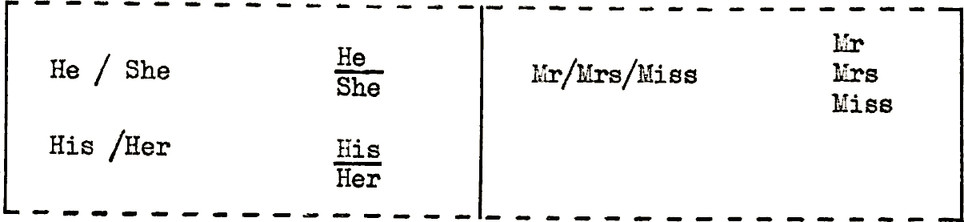
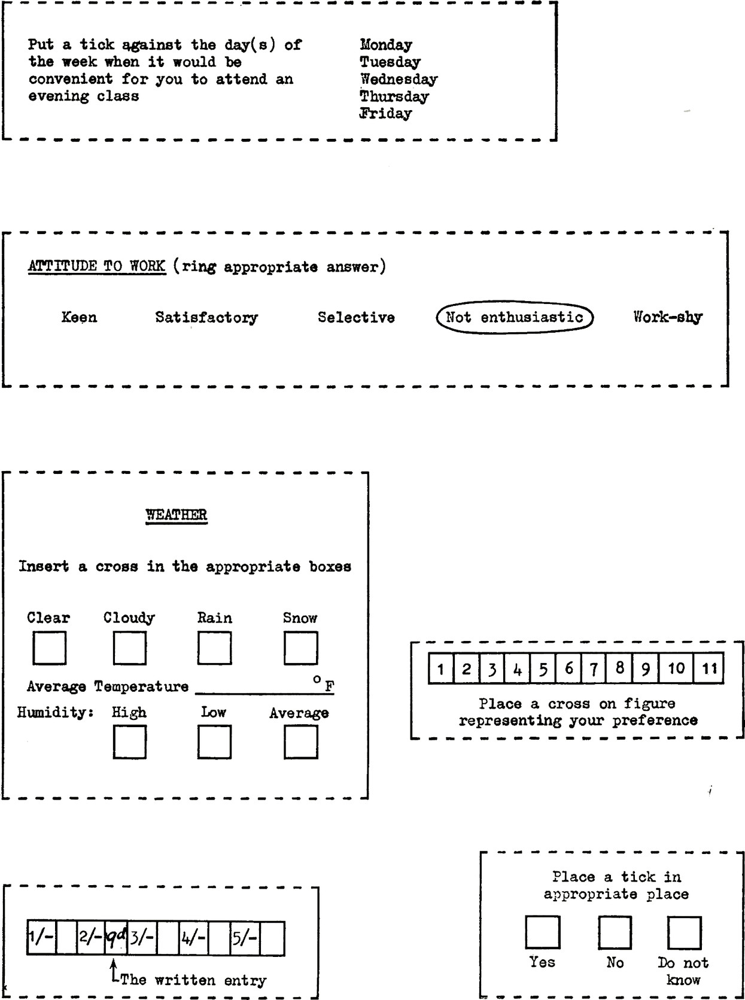
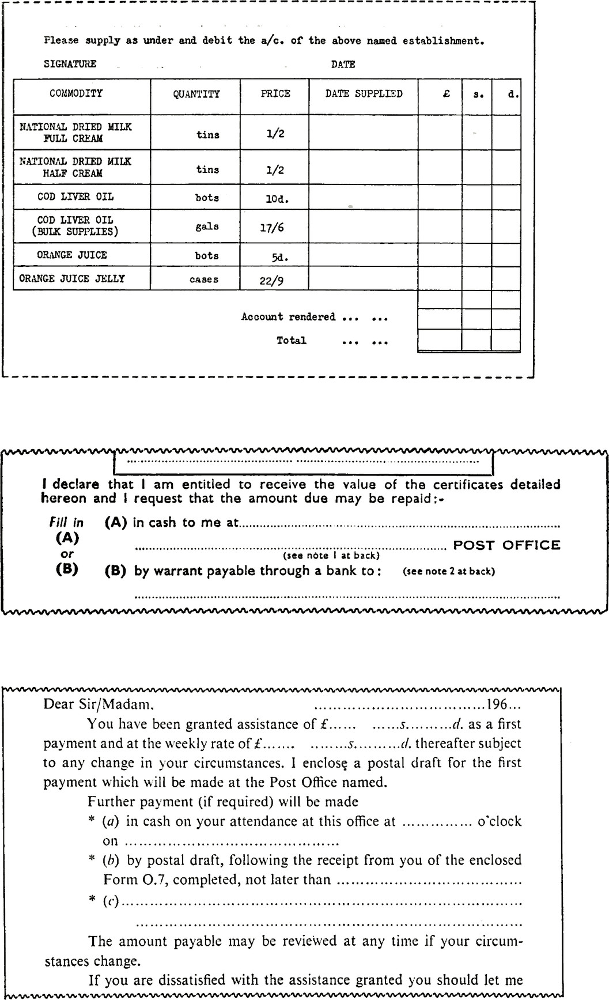

The work of completing a form may be simplified if a series of likely answers to the question is stated and the means of choosing the appropriate answer indicated. An advantage is that answers are obtained with precision and consistency. ‘The methods
adopted to indicate a choice may be:

1. Boxes: provided alongside the stated answers requiring a &times; or a tick to be entered opposite the chosen answer.

2. The chosen words or phrases are ringed by the person completing the form.

3. The words or phrases not applicable are *deleted*.

The choice of entry method will depend on the conditions or circumstances in which the form may be completed; for example, speed of entering information received by telephone may require ticks to be placed against a range of preprinted entries. For all methods, clear instructions are needed to show what is to be done by the person completing the form, e.g. ‘Tick the items required’; ‘Delete words which do not apply’.

Mixed methods of indicating a choice on the same form can be confusing or cause errors in completion. A change in the method should be avoided, especially if it involves a reversal of thought for the person completing the form, e.g. a change from indicating a positive type of entry, e.g. by tick, to a negative one of deleting alternative words and phrases.

If it is anticipated that most of the answers to a series of questions will consist of the word ‘Yes’ and only a few produce qualifications or a ‘No’, the questions should be posed in an order which will avoid an abrupt sequence of thought by the person completing the form.

Rubber stamps to imprint official entries or entry spaces may save space on the form and help to simplify its printed appearance. The position of these entry spaces should facilitate turning over the forms for repetitive stamping; and should reduce the danger of obscuring other entries by faulty stamping.

Captions should be placed close to the boxes to avoid confusion and error

It may be difficult to relate entries to captions when they are placed between boxes

A mixture of methods indicating a choice may lead to errors in completing the form

The arrangement on the left is (in each case) preferable and reduces the need for an
instruction about deleting words not applicable

Choice is indicated by an X in the selected box(es). Rearrangement would avoid repetition
of the words ‘Save’ and ‘Improve’

Unless the place for putting a cross is specified, errors can arise in relating the entry to
the caption. A box avoids this difficulty

See also the illustration of a hospital form created by dyeline copying, [page 146](/copying/making-copies-by-photocopying-methods/)

Methods of indicating a choice between alternatives

Methods of indicating a choice between alternatives

A duplicated form: note the clear and friendly instructions given to disabled persons
completing this form and the method adopted for recording alternative answers
