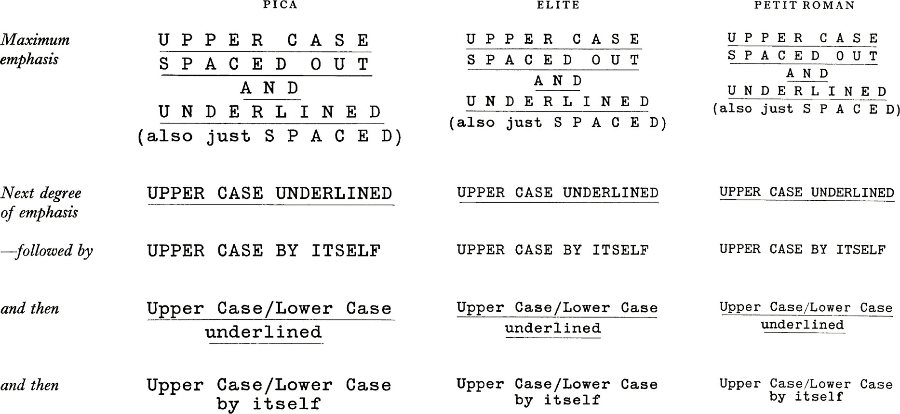
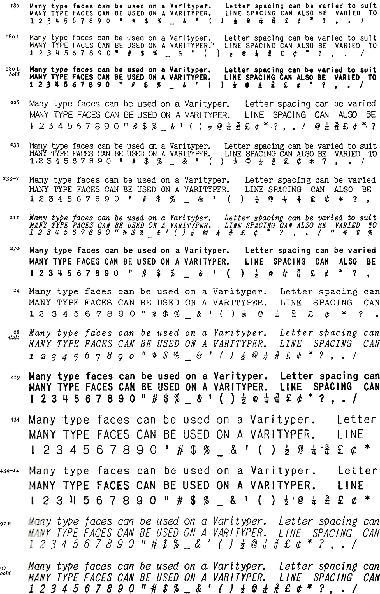
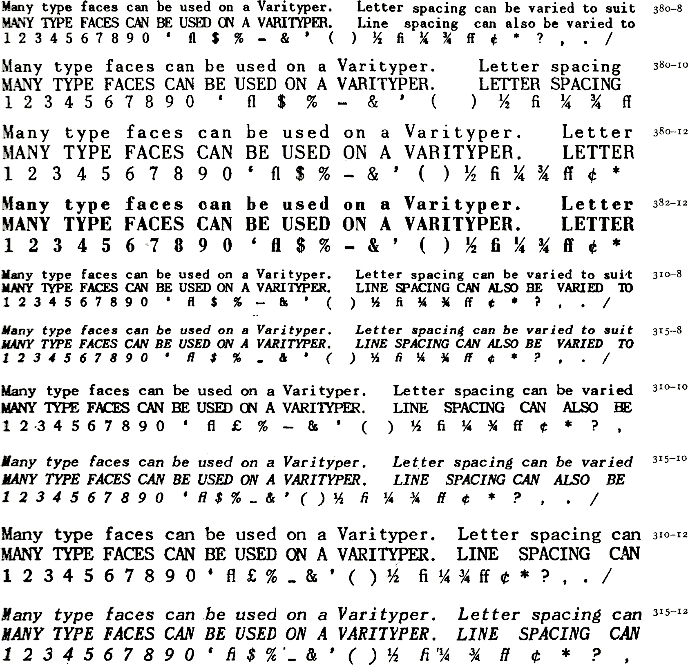

If the form will be duplicated the type faces available can be used to give varying degrees of emphasis.

It is important, however, not to be too lavish with emphasis. If there is both underlining and capital letters for minor items there will be insufficient means of emphasising the major ones.

### Varityping

Special typewriters are manufactured which have a range of interchangeable type faces. If one of these is available a number of other typewriter characters can be introduced. Examples (from the Varityper range), with series numbers, are:

*(a) Suitable for stencil-typing or photolitho reproduction*

*(b) Suitable for photolitho reproduction only*

