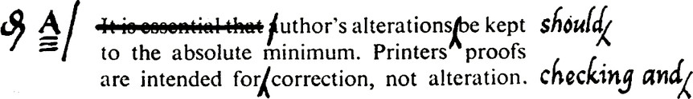

REVIEW OF DATA

Before the final instructions for reproduction are prepared the effectiveness of the
proposed form should be tested as far as possible. However carefully the data for the
design is collected it is always possible that something will be overlooked. Wherever
possible draft designs should be taken to the point where the forms will be used, and
checked by the opinion of those who will use them, and against filled-in copies of any
similar forms already in use. This check should include any practical tests which may
be appropriate, including test entries, in the various operations through which the
new form will pass.

The preparation of procedural instructions for the use of the form (before finally
agreeing the draft for print) sometimes provides an additional check; comparison
between the step by step narrative instruction and the proposed draft will often reveal
flaws which would not be detected by other examinations.

CHOICE OF METHOD OF REPRODUCTION

Simple forms of which only a small stock is required may sometimes be produced
by the offset litho process (unless reasons why this should not be done are stated).
Most forms will, however, be printed by letterpress and the notes below are framed
accordingly; if the offset litho process is used the notes should be read with the
necessary modifications.

PRINTING INSTRUCTIONS

Complete instructions for the Departmental Clerk of Stationery (and, through him,
H.M. Stationery Office) will include information on some or all of the following:

(x) A draft of the form—represented by a written note of content and a sketch of
the layout.
(2) The specification for reproducing the form.

(3) Samples.

(4) Proofs.

(5) Supply arrangements.

(6) Delivery date.

THE DRAFT

A note of the content of the form should be written clearly in ink or typed. In
relation to the style of the copy, e.g. use of capital letters, punctuation, spelling etc.
refer to H.M.S.O. Guide, Part 2: Standards for Authors and Printers.

The preparation of a sketch of a form which is to be printed has been dealt with
earlier.

THE SPECIFICATION is the summary of the physical features of the form as a
direction for reproducing it. Some of these instructions can often be noted on the
draft form, but it is unwise to confuse a draft with lengthy instructions which can as
easily be given separately. ‘The instructions should be clear and concise and should be
set out under appropriate headings, e.g.:

(1) Size of the cut form

fa Eahen orpata ee These details will include the surface required for

cae pen, or pencil etc., erasing quality

(3) Make-up—e.g. Sheets, Sets, Pads, Bound Books, Stitching, Gumming, Cut
corners, Serial numbering etc. (In describing the make-up of books a page should
mean either the left or right hand side of an ‘opening’; a ‘leaf’ is a sheet with a page
on back and front.)

(4) Carbon coating in bands or patches, or one-time carbon

(5) Printing one or both sides of the paper: ‘tumbler’ printing or ‘head-to-head’

(6) Lines: Printed or pen-ruled

Thickness
Colours
Stippling
(7) Printers’ Type: Type faces (The choice can sometimes be left to the printer if
a general indication is given)
Alphabets
Sizes
(8) Ink: Colours
(9) Punching: Shape of holes
Size
Distance from the side and top edges of the paper to the centre of
the hole
Distance between the centres of holes
(10) Perforating
(11) Scoring
(12) Folding

SAMPLES should be provided wherever they will help to make the reproduction
instructions precise, for example, specimens of the coloured ink or paper required,
or of unusual punched holes. They should be cancelled and clearly marked ‘not for
reproduction’. When the entry spaces on the form must register with those on an
existing form, a specimen of the latter should always be provided. Samples will often
prevent the ambiguity in instructions due to misreading of terms such as those men-
tioned above. When forms are to be used in conjunction with mechanical posting it is
of great assistance to the printer if the ‘copy’ is accompanied by an actual ‘print’ from
the machine to show column widths etc.

PRINTERS’ PROOFS can be dispensed with if the form is very simple, and clear
copy is given to the printer. When proofs are desired, only a small number should be
asked for and they should be regarded as specimens on which to decide whether the
printer has interpreted the copy correctly; they should not be regarded as ‘fair drafts’
of the design on which the need for further amendments can be judged more easily
than with a hand draft. Changes at the proof stage can delay delivery and add con-
siderably to the cost of the form in resetting type.

Proofs are not always printed on the same class of paper as will be used for the
supply of copies; the appearance of proof copies is, therefore, not necessarily that of
the final print. Proofs of forms which are subsequently to be ruled should be marked
to indicate the exact position of lines and spacing required. Completely ruled proofs,
and proofs of ruling only, are not supplied; where a draft pattern is perfectly clear, the
onus of correct reproduction rests on the contractor. When proofs or revises are
received from the printer it is advisable to mark them ‘1st proof’, ‘2nd proof’ etc.
Corrections to proofs should be made in accordance with the H.M. Stationery Office
List of Printers’ Correction Marks.

Most of the alterations made on proofs are avoidable because they could have been
made on the typescript before typesetting began. If the author thinks ‘I’m not sure
about this, but I can always alter it on the proof’, extra costs will be involved. Even
the simplest amendment, so easy to make on a proof, is time-wasting and costly to
carry out.

In the above example, the author has simply deleted a full point, substituted a colon,
altered one letter and inserted a comma. The compositor must lift the second and
third lines of type into his stick, make the corrections, respace the lines, and replace
them. The type will be reproofed and checked by the printer. These alterations would
cost as much as 2s. 6d.

A few words added or deleted may mean the respacing of a large number of words
by the compositor, or resetting the whole paragraph, with all the subsequent opera-
tions. Authors should consider whether the alterations are sufficiently important to
warrant the cost, which in this example might be 5s.

Symbols for correcting proofs are detailed on pages 161-165. If these standard
symbols are always used, corrections will be clear, unambiguous, and understood by
all printers. It has been said that authors would dispense with most of their alterations
if they had to pay on the spot for making them; where an alteration is essential, one
should try to make it in such a way that a minimum amount of extra work will be
involved. For instance, where an additional word is necessary, a word or words of
about the same number of letters should be deleted: if it is necessary to delete a word
one should try to add a word. Similarly, if it is necessary to add a line, it may be’
possible to knock out a line, even if it is a line of only one word, otherwise the whole
paragraph may have to be reset.

Author’s corrections cost money and cause delay: a
high proportion of alterations have to be done by hand
by the printer—the most expensive way of setting type

SUPPLY ARRANGEMENTS concerning the quantity to order and reprints will also
need to be considered. Whilst a decision on the proper stocks of forms to be held will
not usually lie with the person designing the form, the familiarity with the uses of the
form which that person must have gained in preparing the design, makes it desirable
that he should indicate the rate of consumption and how that rate is likely to change
in the course of (say) the next six months.

If the form is likely to be reprinted, every effort should be made to see that it is in
a final design when first reproduced, so that no alterations which are really after-
thoughts need be made on reprinting. Production costs are reduced if the same type
etc. can be used again, and if repeat orders are likely after a certain period this should
be stated. The type-standing procedure is explained more fully in H.M. Stationery
Office Guide, Part 1: Notes for Clerks of Stationery. If at any time it is proposed that a

form, previously printed, should in future be reproduced by a Departmental Repro-
duction Service, H.M.S.O. should be informed so that any printing contract arrange-
ments can be altered.

Where a new form is required for an important new procedure, it may be wiser to
assume that experience of using the form will show that minor changes in design are
necessary. If a twelve-months stock is ordered, there is the risk that part may have to
be wasted, or desirable changes unduly deferred. Advice should therefore be given to
the Clerk of Stationery on whether the first order should be for a (say) four months
trial quantity, or whether a normal stock should be printed. H.M.S.O. should also be
consulted if it becomes necessary to produce a small quantity of forms, by another
process, pending the receipt of a main (printed) supply.

WRITING THE SPECIFICATION

When determining the quantity of forms to order regard should also be paid to the
H.M. Stationery Office ‘Maximum Holding System’. A maximum holding should be
established for each item held in each Stationery Store, the holding being assessed on
the following basis:

(1) An estimate of the quantity likely to be used during the period for which the
demand for replenishment of stock is normally placed.

(2) An amount to cover the estimated consumption of the item for the period it
normally takes for the goods to be delivered.

(3) A working reserve (as a general guide an amount equal to one month’s con-

sumption should be adequate).
The maximum holding quantities should be reviewed periodically. A demand for the
replenishment of any particular item should bring the stock up to the maximum
holding quantity having regard to any quantities due to be delivered against any
outstanding demand.

THE DELIVERY DATE and place of delivery should be stated, including the quan-
tities required on various dates if delivery will be spread over a period. When a new
form involves a major change in procedure, or a changeover to machine working,
forms must be delivered in adequate time beforehand so that staff will have an
opportunity to familiarise themselves with the new arrangements. Items such as
ribbons, carbons, or any other ancillary equipment should also be ordered in good
time.

The number of operations involved will affect the time required to produce the
work, e.g. printing, ruling, perforating, numbering, gathering, stitching, and binding
will obviously take longer than simple printing. Exceptionally heavy demands may
necessitate a special making of paper so that six weeks may elapse before the printer is
in a position to begin the actual printing. Printers have to organise their work in
advance and in fixing dates for delivery not less than six to twelve weeks should
normally be allowed for the execution of the work. When this is not possible it may be
advisable to consult H.M, Stationery Office before planning dates are finally settled.
