NOTES ON THE USE OF SYMBOLS

FOR CORRECTING PROOFS

ALL corrections should be distinct and made in ink in the margins; marks made in
the text should be those indicating the place to which the correction refers.

Where several corrections occur in one line, they should be divided between the
left and right margins, the order being from left to right in both margins, and the
individual marks should be separated by a concluding mark.

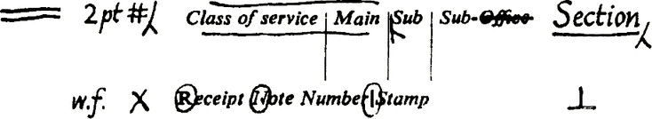

When an alteration is desired in a character, word or words, the existing character,
word or words should be struck through, and the character to be substituted written
in the margin followed by a /.

Where it is desired to change one character only to a capital letter, the word ‘cap’
should be written in the margin. Where, however, it is desired to change more than
one character, or a word or words, in a particular line to capitals, then one marginal
reference, ‘caps’, should suffice, with the appropriate symbols made in the text as
required.

Three periods or full stops (constituting an ellipsis, see No. 61) should be used to
indicate an omission, except where the preceding sentence has been concluded, in
which case four full stops should be inserted, the first of which should be close up to
the preceding word.

Normally, only matter actually to be inserted or added to the existing text should be
written on the proof. If, however, any comments or instructions are written on the
proof, they should be encircled, and preceded by the word PRINTER (in capitals and
underlined). The table begins on page 161.

\* Extracted from British Standard 1219

(Words in italics in the marginal marks column are instructions and not part of the marks)

| No. | Instruction | Textual mark | Marginal mark |
| - | - | - | - |
| 1 | Correction is concluded | None |  |
| 2 | Insert in text the matter indicated in margin |  | New matter followed by  |
| 3 | Delete | Strike through characters to be deleted |  |
| 4 | Delete and close up | Strike through character to be deleted and use mark 21 |  |
| 5 | Leave as printed |  under characters to remain |  |
| 6 | Change to italic |  under characters to be altered |  |
| 7 | Change to even small capitals |  under characters to be altered |  |
| 8 | Change to capital letters | 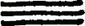 under characters to be altered |  |
| 9 | Use capital letters for initial letters and small capitals for rest of words |   under initial letters and    under the rest of the words |  |
| 10 | Change to bold type | 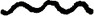 under characters to be altered |  |
| 11 | Change to lower case | Encircle characters to be altered |  |
| 12 | Change to roman type | Encircle characters to be altered |  |
| 13 | Wrong fount. Replace by letter of correct fount | Encircle characters to be altered |  |
| 14 | Invert type | Encircle character to be altered |  |
| 15 | Change damaged character(s) | Encircle character(s) to be altered |  |
| 16 | Substitute or insert character(s) under which this mark is placed, in ‘superior’ position |  through character or  where required |  under character (e.g. 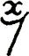)  |
| 17 | Substitute or insert character(s) over which this mark is placed, in ‘inferior’ position |  through character or  where required |  over character (e.g. ) |
| 18 | Underline word or words |  under words affected |  |
| 19 | Use ligature (e.g. ffi) or diphthong (e.g. ce) |  enclosing letters to be altered |  enclosing ligature or diphthong required |
| 20 | Substitute separate letters for ligature or diphthong |  through ligature or diphthong to be altered |  write out separate letters followed by  |
| 21 | Close up—delete space between characters |  linking characters |  |
| 22 | Insert space* | | 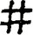 |
| 23 | Insert space between lines or paragraphs* | 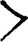 between lines to be spaced |  |
| 24 | Reduce space between lines* |  connecting lines to be closed up |   |
| 25 | Make space appear equal between words |  between words |   |
| 26 | Reduce space between words* |  between words |   |
| 27 | Add space between letters* | 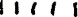 between tops of letters requiring space | 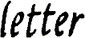  |
| 28 | Transpose | 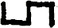 between characters or words, numbered when necessary |  |
| 29 | Place in centre of line | Indicate position with  |  |
| 30 | Indent one em | 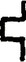 | 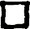 |
| 31 | Indent two ems |  |  |
| 32 | Move matter to right |  at left side of group to be moved |  |
| 33 | Move matter to left |  at right side of group to be moved |   |
| 34 | Move matter to position indicated |  at limits of required position | 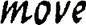 |
| 35 | Take over character(s) or line to next line, column or page |  |  |
| 36 | Take back character(s) or line to previous line, column or page |  | 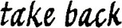 |
| 37 | Raise lines† |  over lines to be moved    under lines to be moved | 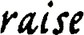 |
| 38 | Lower lines† |  over lines to be moved    under lines to be moved | 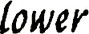 |
| 39 | Correct the vertical alignment | 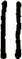 |  |
| 40 | Straighten lines | 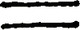 through lines to be straightened |  |
| 41 | Push down space | Encircle space affected | 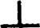 |
| 42 | Begin a new paragraph | 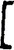  before first word of new paragraph | 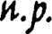 | 
| 43 | No fresh paragraph here |  between paragraphs | 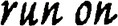 |
| 44 | Spell out the abbreviation or figure in full | Encircle words or figures to be altered | 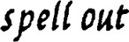 |
| 45 | Insert omitted portion of copy‡ |  |  |
| 46 | Substitute or insert comma |  through character or  where required |  |
| 47 | Substitute or insert semi-colon |  through character or  where required | 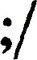 |
| 48 | Substitute or insert full stop |  through character or  where required | 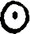 |
| 49 | Substitute or insert colon |  through character or  where required |  |
| 50 | Substitute or insert interrogation mark |  through character or  where required |  |
| 51 | Substitute or insert exclamation mark |  through character or  where required | 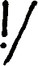 |
| 52 | Insert parentheses |  or  |  |
| 53 | Insert (square) brackets |  or  | 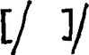 |
| 54 | Insert hyphen |  | 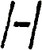 |
| 55 | Insert en (half-em) rule |  |  |
| 56 | Insert one-em rule |  | 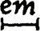 |
| 57 | Insert two-em rule |  |  |
| 58 | Insert apostrophe |  |  |
| 59 | Insert single quotation marks |  or  | 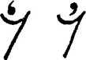 |
| 60 | Insert double quotation marks |  or  |  |
| 61 | Insert ellipsis§ |  | 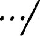 |
| 62 | Insert leader |  |  |
| 63 | Insert shilling stroke |  | 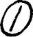 |
| 64 | Refer to appropriate authority anything of doubtful accuracy | Encircle words, etc. affected | 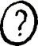 |

\* Amount of space and/or length of re-spaced line may be indicated.

† Amount of space and/or length of line may be included.

‡ When fresh matter not in the copy is to be inserted, the caret mark is to be used in
the text and “Take in A’ (‘B’, ‘C’, etc., as the case may be) written in the margin, the additional
matter whether written on the proof or on attached slips being lettered to correspond. In the
case of large insertions a horizontal arrow in the margin pointing between the lines replaces
the caret mark.

§ See notes on use of symbols.
