The bodies of the specimen rules are of various sizes to work in with type. Rules
should never be used merely for underlining or stressing: bolder type, capitals, or
italic will achieve the desired result.

[Rule images + captions]

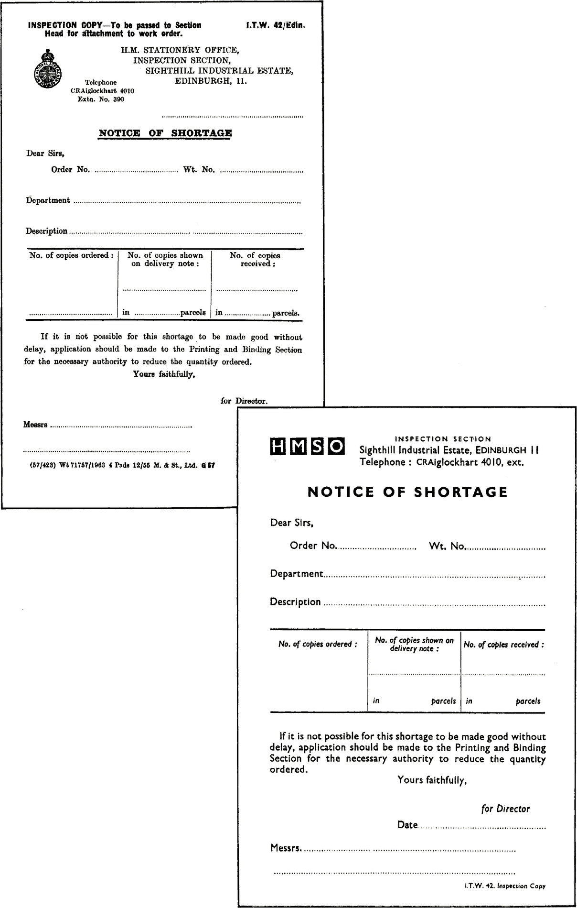

Before and after redesign

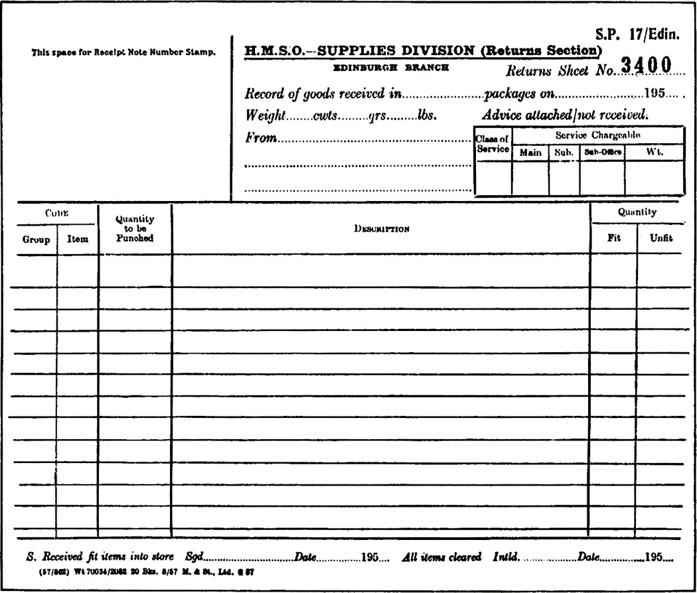

Before and after redesign

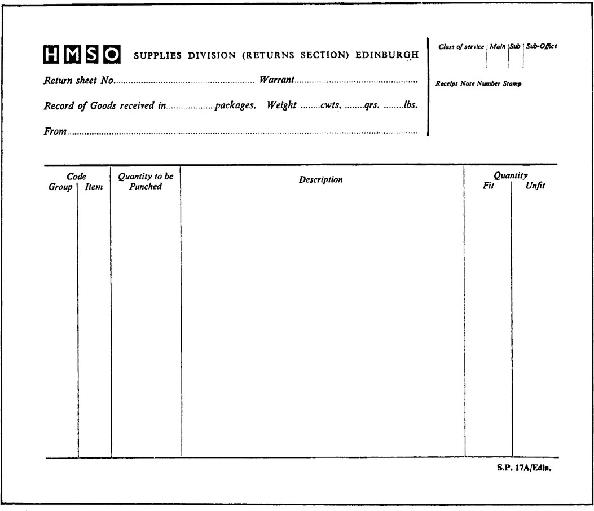

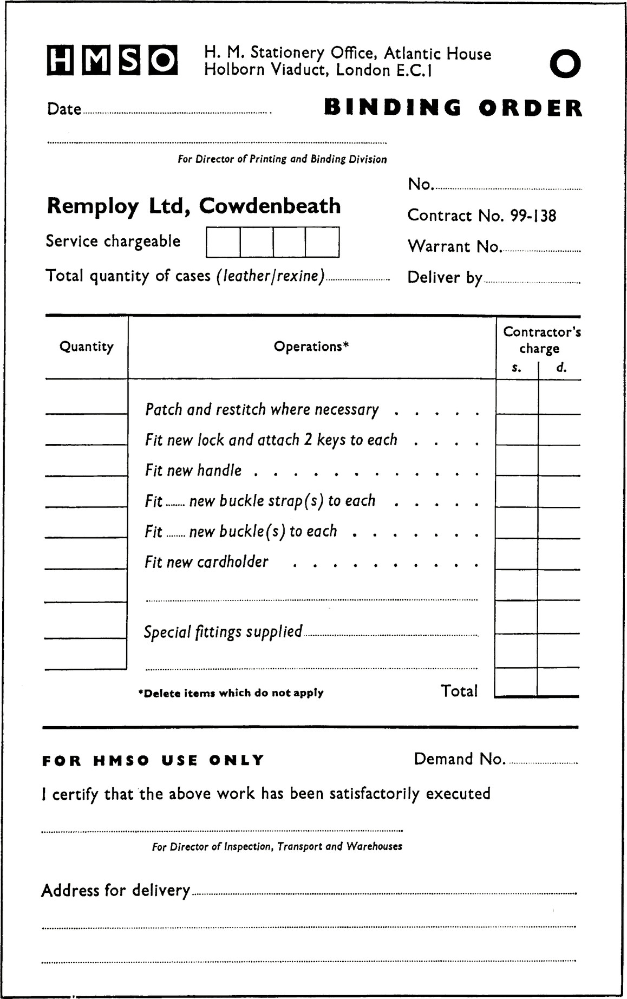

Original ‘copy’ and layout for this special form are shown overleaf for comparison

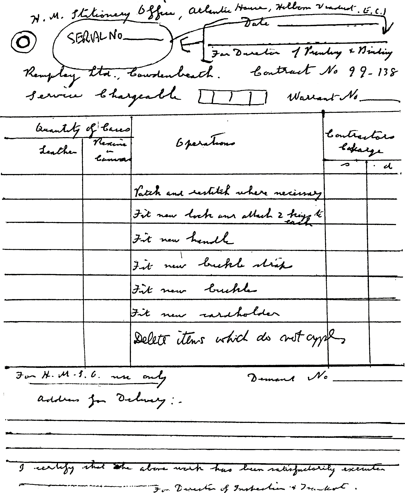

Original ‘copy’ for a numbered and metal-tagged form on stout paper, obviating the
writing out of a separate order, label and contractor’s charge slip and involving only the
crossing out of instructions that do not apply. The final layout is shown opposite, and the
final printed form is illustrated on page 123

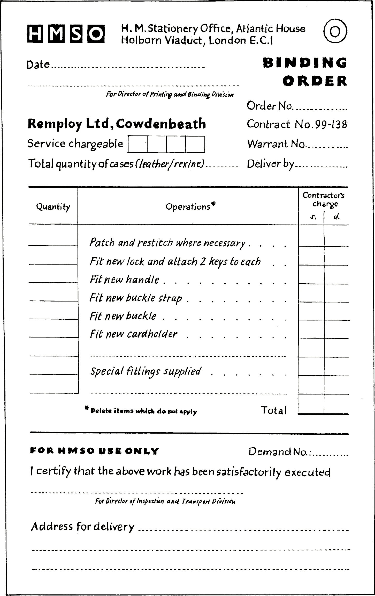

An experimental form at final layout stage, designed from ‘copy’ shown opposite

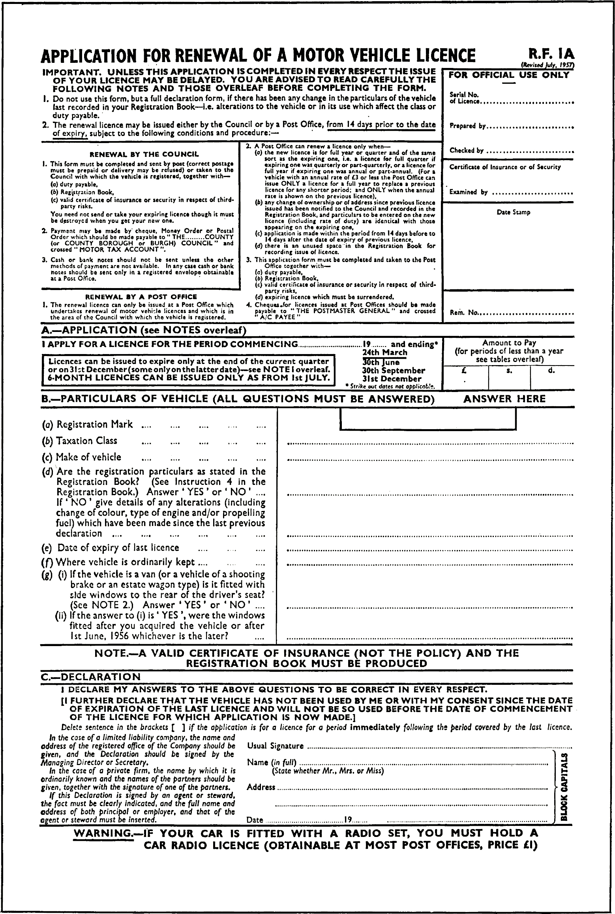

This (earlier) version of a well-known application form tends to have a cluttered, rambling
and over-boxed appearance

A theoretical restyling by a typographer, purely from the typographical angle, of the form
opposite

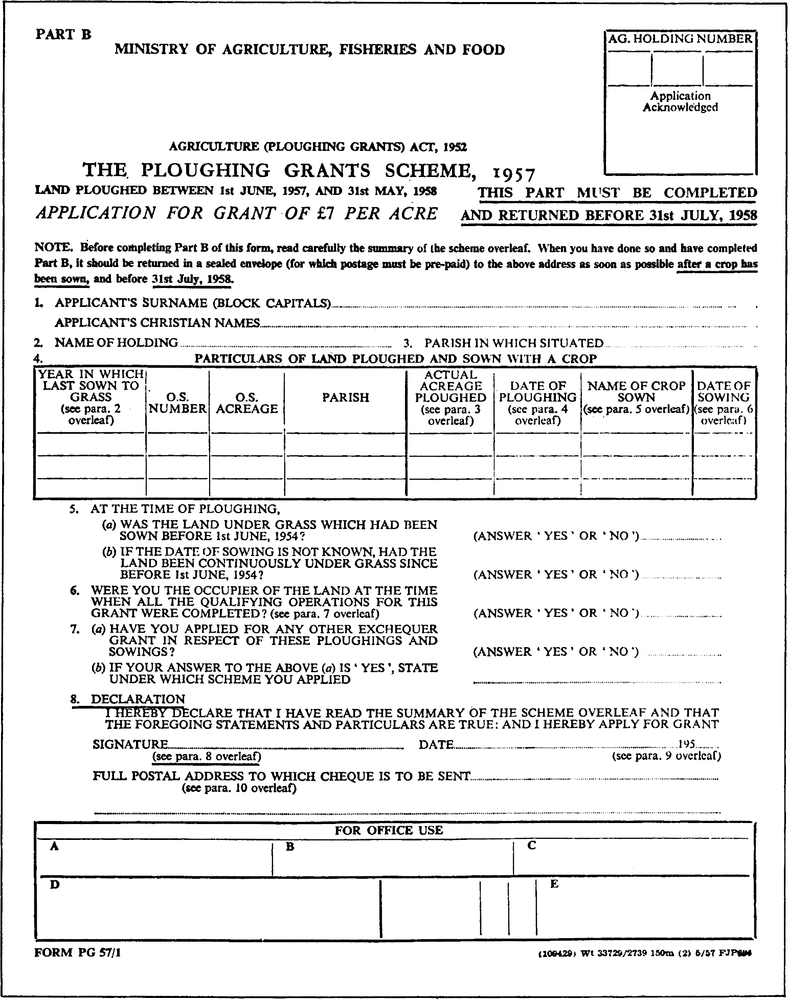

The extensive use of capitals reduces legibility and spoils the appearance of the form.
A restyling is shown opposite

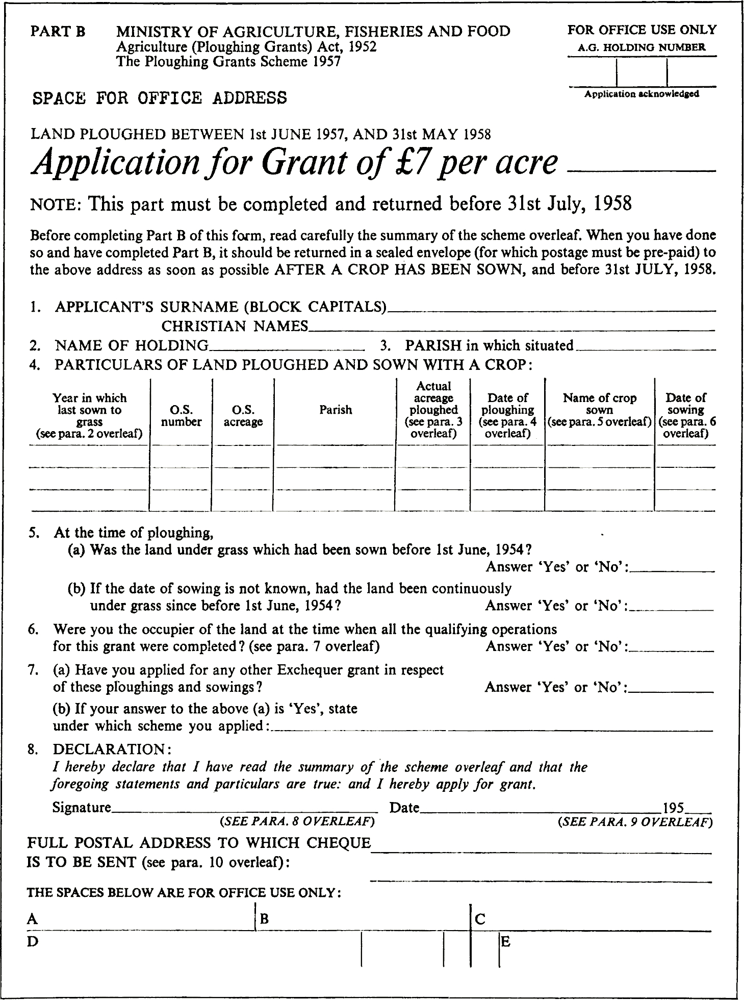

A restyling of the form shown opposite

For headings such as the name of the department, 10 or 12 point size is usually sufficient.
The size of type and position of the name of the department, or title of the form, should
not detract the eye and attention from more important wording nearby. Generally, the
title of the form should stand out more boldly than the name of the department and type
should be chosen accordingly to give this effect

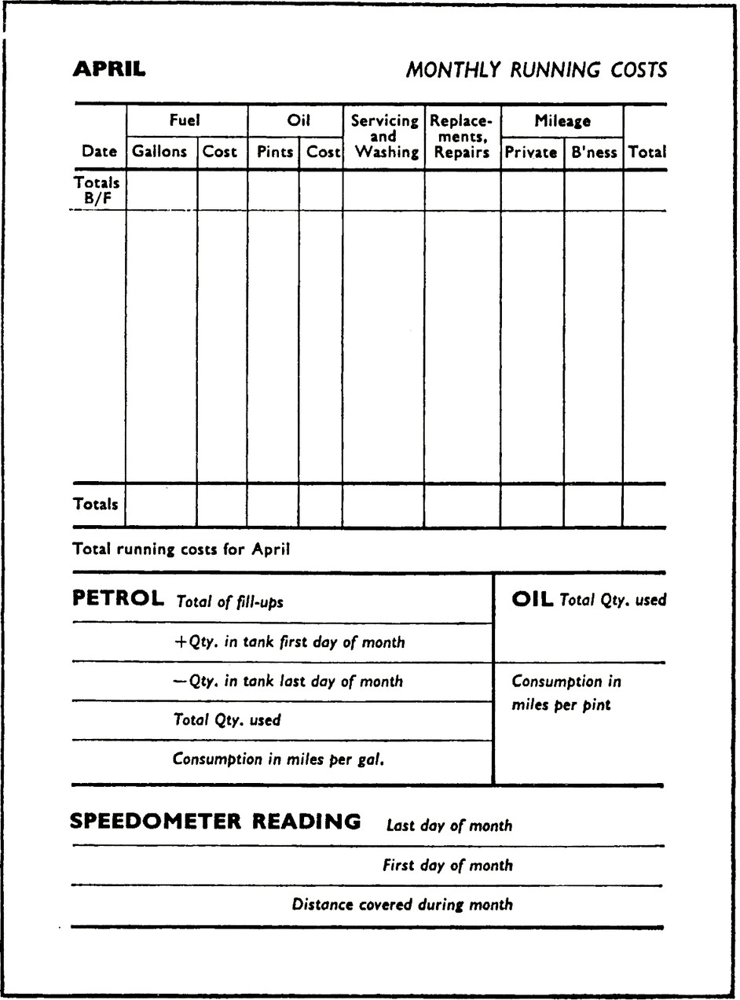

Illustrating good
use of thick and
thin rules and
suitable type
(all in Gill series)

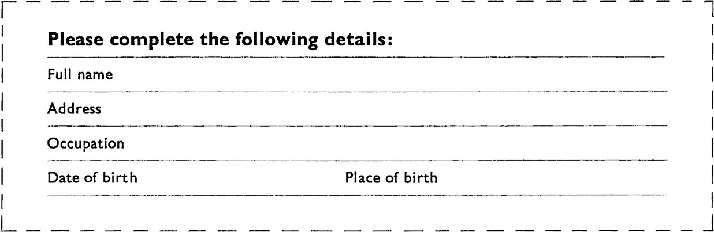

A clear and simple appearance with appropriate emphasis is obtained in these examples
with two weights of type including the heading

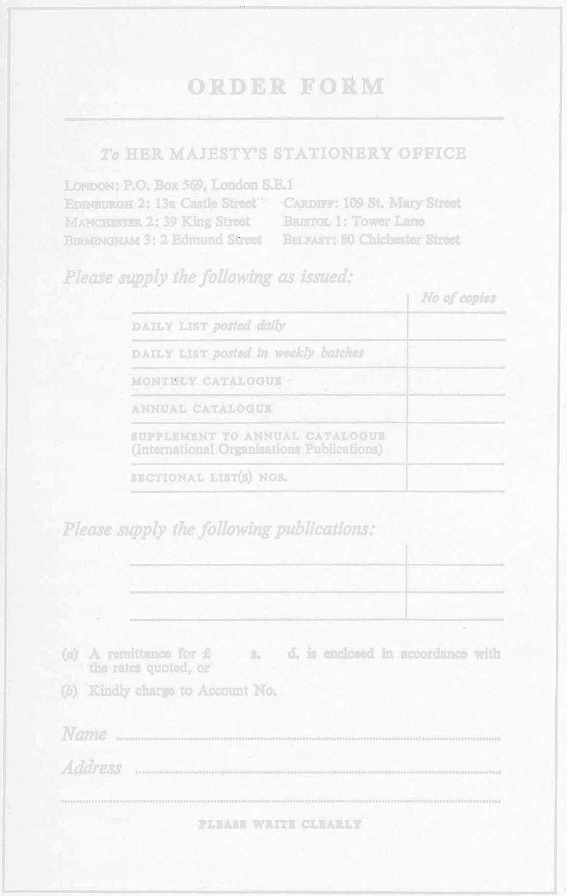

Letter-spaced capitals in heading and at foot. Italic for subtle emphasis

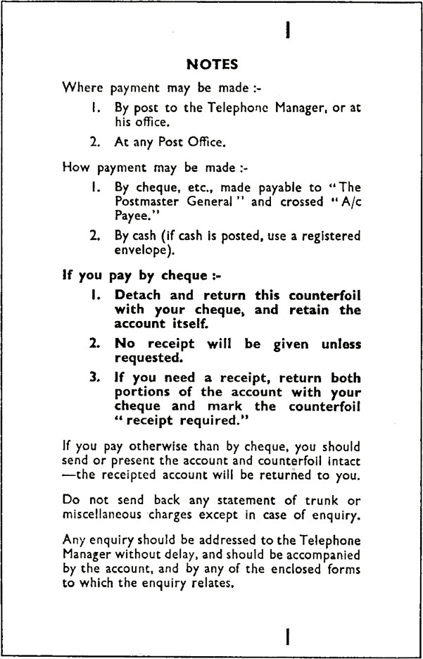

Simplicity of treatment,
using Gill Sans series

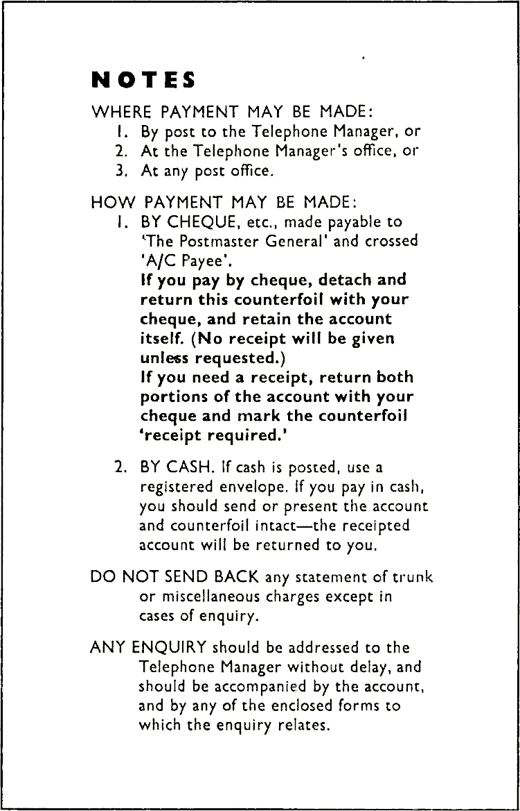

A suggested restyling, again using
Gill Sans series throughout
