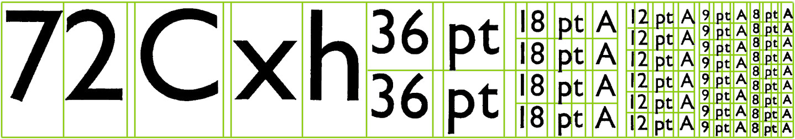

The alphabets illustrated provide a wide range of sizes. Gill Sans and Times Roman
are particularly useful for forms design and the sizes most commonly used are 8, 10,
12, 14, 18, 24, 30, 36, 48, 60 and 72 point. Sometimes g and 11 point are also available.
Type smaller than 8 point is available but old people may have difficulty in reading it.
The standard sizes combine well together thus—one line of 72 point type will always
fit in perfectly alongside two of 36 point, four of 18 point, six of 12 point, eight of
9 point etc.

Type is composed either by hand or machine. With machine composition it is not
practicable freely to mix a number of type faces (or sizes) on one line.

The appearance of letters set in capitals, e.g. for headings, can be improved by
slight spacing between letters.

In drafting a sketch of a form the designer may wish to know approximately the
number of printed letters or words of a given size which can be expected to fill a
certain space (or conversely the space required for a given number of letters or words
of a certain size). Some indication of the space taken up by the various type faces and
sizes is given in these notes and illustrations, but it should not be difficult to find
printed illustrations of the required type, e.g. in old forms, to cut out an area of print
equivalent to the space concerned, and count the number of words or letters enclosed
therein. This will usually give sufficient data for the drafter’s purpose.
