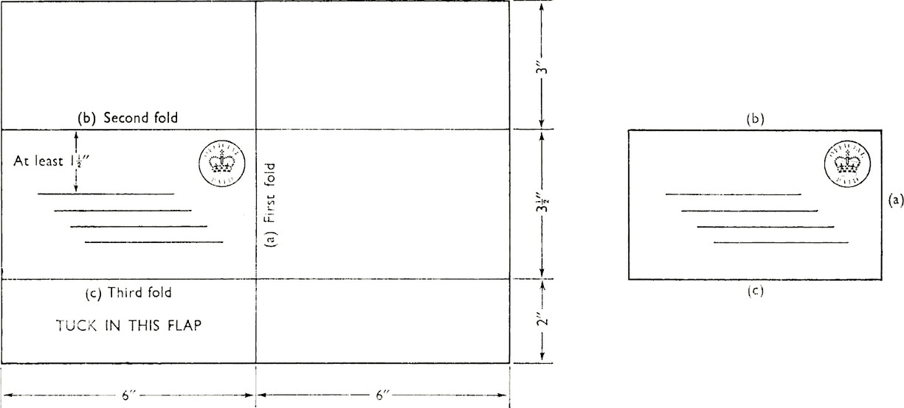

Postal folders, cards and labels can be designed for ‘two-way’ use. Forms designed as
a postal folder not only eliminate a covering letter, but also cut out the cost and work
involved in using envelopes; they are particularly suitable when the information trans-
mitted is not confidential, and when the folder makes it easier for the recipient to deal
with the reply in this way.

Folding marks and folding instructions on the form should be printed where they
can be seen while the form is being folded. It is better to print marks with which the
edges of the form should be aligned, than lines to mark the place where the fold should
be made. In particular, lines printed on the inside of the fold should be avoided.

It is important to note that Post Office rules require that the folded or closed end of
the postal folder must be the same end as that to which the postage stamp or ‘Official
Paid’ design is attached; it is this end of the folder which first passes through the
stamp cancelling machine and this layout helps to reduce the possibility of damage or
difficulty during this machine process. Flimsy or dark paper is unsuitable for postal
purposes.

For postal folders there are several alternative designs available; those shown follow-

ing form part of the Post Office leaflet ‘Folders Suitable for Postal Purposes’
(HQ 72/58) the content of which is as follows:
The use of folders for postal purposes is, in general deprecated by the Post Office, as
folders tend to be more difficult to handle than envelopes or cards. For example, they are
liable to damage in stamp-cancelling machines, or to be torn as they pass through a machine,
causing a jam which involves stopping the machine and so delaying the work. Again, at the
sorting stage, they may cause delay through other communications catching in the open
ends.

It is realised, however, that many posters find folders very convenient and objection will
not be raised to their use provided that they are made up on the lines indicated in the
diagrams in this leaflet and that the following requirements are observed:

(1) Limits of size: Minimum 4” x23”

Maximum 6” x 33”
NOTE: The minimum dimensions quoted apply to envelopes and cards generally. It is
often found that folders designed to fold to these dimensions are, owing to faulty printing
or folding, below the minimum size. Moreover, after adequate space has been left for the
postage stamp and date-stamp impression (see (2)) the minimum depth of 23” leaves little
room for the address. It is therefore recommended that the minimum size should be taken
as 4” X3”.

(2) A space of at least 13” for date-stamp impressions must be left above the address.

(3) Any printing on the address side, other than the address, must be confined to the
left-hand half of that side.

(4) Stout paper should be used. White paper is preferable, but there is no objection to
the use of pale shades of buff, yellow, green or blue. It is essential, however, that the ink
used on coloured paper should be in sharp contrast with the tint of the paper. Printing in
red ink is objectionable.

(5) Wire clips, staples or stitches should not be used to secure folders.

NOTE: Packets intended for transmission at the Printed Paper rate must comply with the
regulations of that rate. (See Post Office Guide, or leaflet P386, obtainable at any Head
Post Office.)

(1) Single: minimum size

(2) Single: maximum size

(3) Single: alternative layout showing economical method of cutting

(4) Reply folder

(5) Reply folder: alternative layout

NOTE: When it is necessary to type both addresses on a reply folder (see No. 4) before
despatch, it is not possible to design a layout which avoids taking the folders out of the
machine to type the second address, since the closed end of the folder must be the same
end as that to which the postage stamp or ‘Official Paid’ design is attached.

(1) Single Folder

NOTE: The tongue & slot
side should not be used
for the address. The slot
should preferably be at least
1}” below the top edge
when folder is made up.

(2) Double journey folder

(3) Alternative type of reply or double journey folders

NOTE: This arrangement saves the use
of a label to cover old postmarks, etc.
